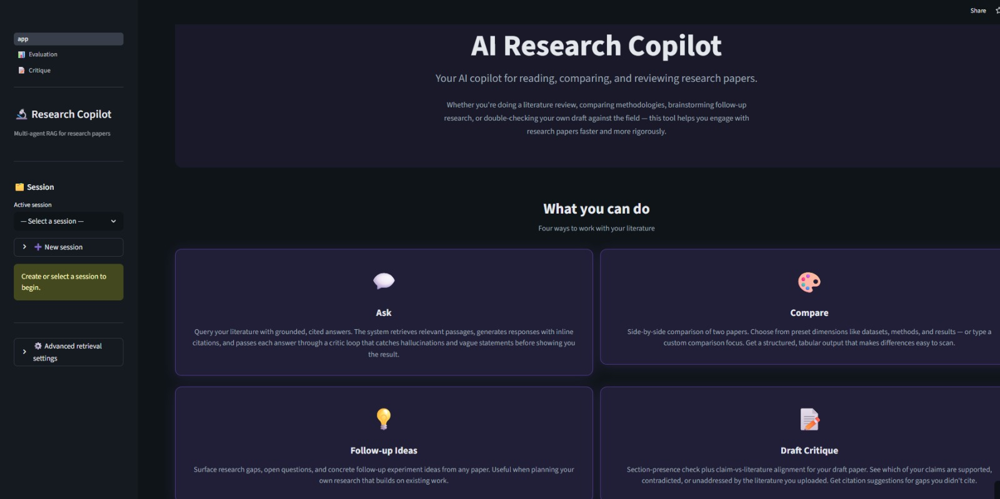
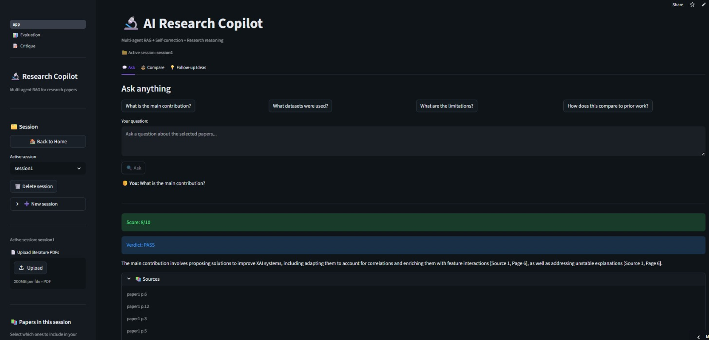
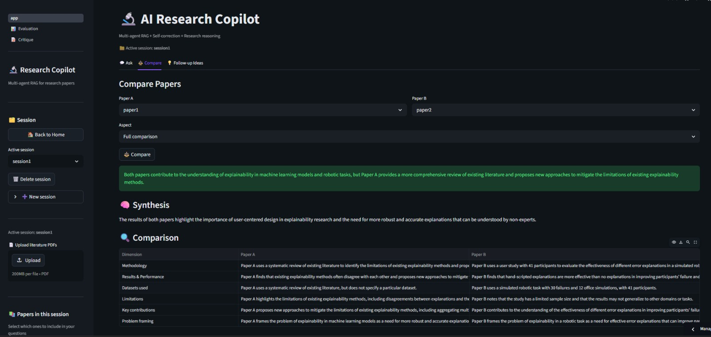
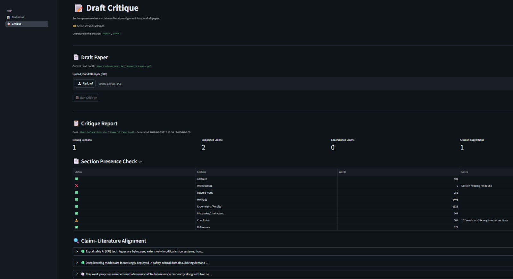
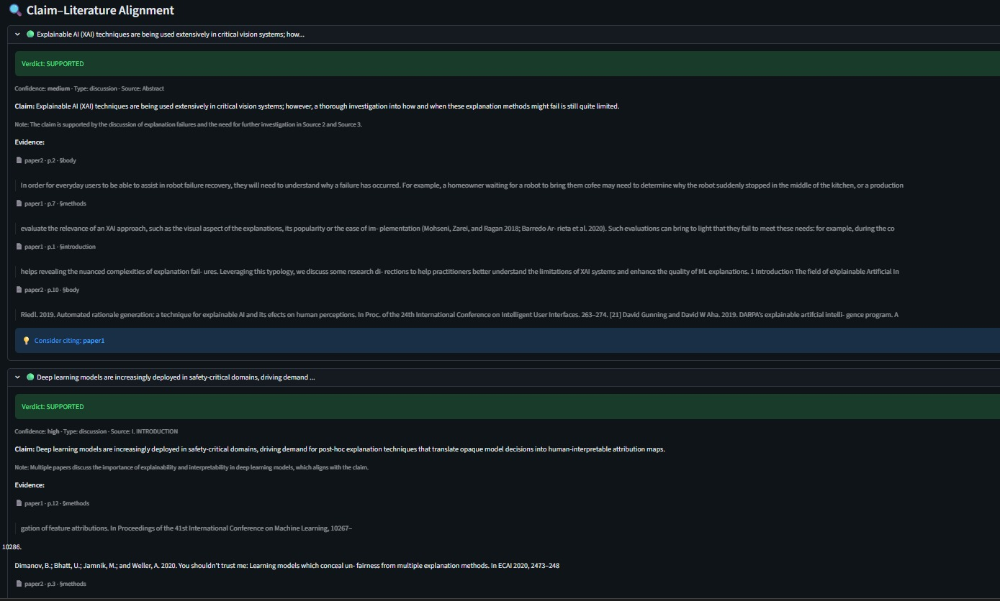
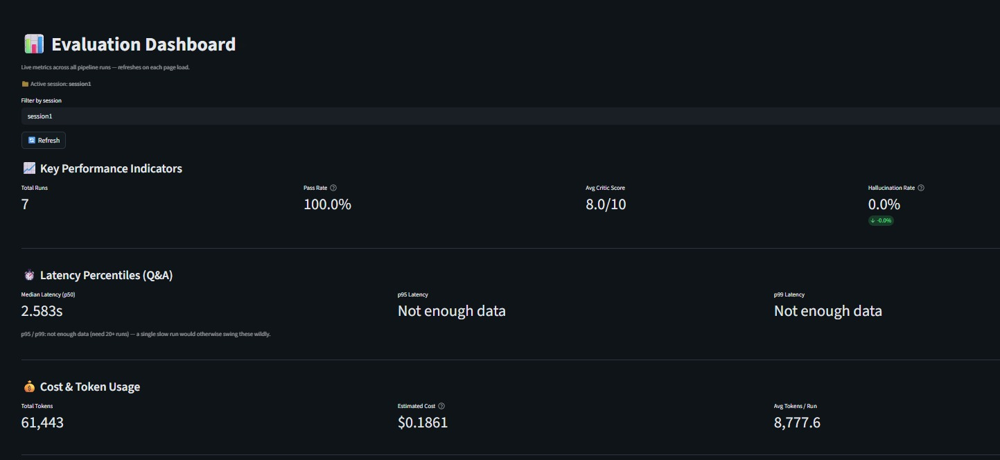

# AI Research Copilot

*A multi-agent RAG system for research paper Q&A, comparison, and draft critique — grounded, self-correcting, and observable.*


## 🚀 Live Demo

**Live at:** [research-copilot-app.streamlit.app](https://research-copilot-app.streamlit.app)

> Note: The app runs on Streamlit Community Cloud's free tier. Cold starts may take 30-60 seconds after periods of inactivity.



## Overview

Researchers working through a literature review, comparing methodologies, or checking their own draft against the field face a common problem: staying grounded in evidence rather than in generic summaries or LLM hallucinations. Existing tools either retrieve without verification or generate without citations.

AI Research Copilot combines multi-agent orchestration with grounded retrieval to help researchers engage with papers more rigorously. Upload literature into a session, then ask questions, compare papers, generate follow-up research ideas, or critique your own draft against the uploaded evidence.

Built for undergraduate and graduate researchers, PhD students planning follow-up work, and anyone doing structured literature engagement.

## Features

### Ask

Query your literature with grounded, cited answers. The system retrieves relevant passages via section-aware FAISS retrieval, generates responses with inline citations, and passes every answer through a critic agent that verifies grounding and catches vague or hallucinated content. When the critic flags an answer as insufficient, the system generates a refined query and retries automatically.



### Compare

Side-by-side comparison of two papers. Choose from preset dimensions (datasets, methodology, results, limitations) or type a custom aspect. Returns a structured table making differences easy to scan.



### Follow-up Ideas

Surface research gaps, open questions, and concrete follow-up experiment ideas from any paper. Useful when planning your own research building on existing work.

### Draft Critique

Section-presence check plus claim-vs-literature alignment for your own draft. The system extracts atomic claims from your draft, retrieves relevant literature passages, and classifies each claim as SUPPORTED, CONTRADICTED, or SILENT — with grounded evidence quotes and citation suggestions.





## Observability

The Evaluation dashboard tracks system health across every run: pass rate, hallucination detection rate, latency percentiles (p50/p95/p99 with a 20-run minimum for statistical validity), and per-pipeline-type cost tracking with token estimation.



## Architecture

- **Multi-agent orchestration:** LangGraph-based state machines. Q&A uses a retriever → answering → critic → retry loop where the critic can send answers back for refined retrieval. Critique uses a linear pipeline: section-check → claim extraction → evidence retrieval → classification → report assembly.

- **Session isolation:** Each session gets its own FAISS index and storage directory. Papers, drafts, and evaluation logs don't leak across sessions. Session state persists across app restarts via JSON manifest.

- **Grounded retrieval:** Section-aware FAISS with metadata filtering. Retrieval can be scoped to specific papers via checkbox selection in the sidebar.

- **Two-model strategy:** Fast synthesis via Llama 3.1 8B (Groq), reasoning-heavy tasks (critic verification, critique classification) via Llama 3.3 70B.

- **Programmatic safety net:** For CONTRADICTED verdicts in the critique feature, the system verifies the classifier's quoted contradicting sentence actually appears in retrieved context before displaying it — automatic downgrade to SILENT if not found. Prevents overconfident false-positive contradictions.

## Tech Stack

| Layer | Tools |
|-------|-------|
| Frontend | Streamlit |
| Orchestration | LangGraph, LangChain |
| LLM Provider | Groq (Llama 3.1 8B, Llama 3.3 70B) |
| Vector Store | FAISS |
| Embeddings | SentenceTransformers (all-MiniLM-L6-v2) |
| PDF Parsing | PyMuPDF |
| Data Validation | Pydantic |
| Deployment | Streamlit Community Cloud |

## Validation

Validated end-to-end using a real IEEE-published paper as the draft (EdgeBlockAI, presented at IEEE AIDE 2026) with four related supply-chain anomaly detection papers as literature.

Results:

- **Section detection:** 8/8 canonical sections correctly identified
- **Claim extraction:** 12/12 real claims extracted from the paper (no hallucinated claims)
- **Classification:** 2 SUPPORTED verdicts (both with valid supporting evidence), 10 SILENT verdicts (correctly — those claims are paper-specific and unaddressed by the chosen literature), 0 false CONTRADICTED

The tool showed appropriate conservatism — no false-positive support claims and no manufactured contradictions.

## Local Setup

### Prerequisites

- Python 3.11 or 3.12
- Git
- A Groq API key (free tier available at [console.groq.com](https://console.groq.com))

### Installation

```bash
git clone https://github.com/Aasrika/ai-research-copilot.git
cd ai-research-copilot
python -m venv venv
source venv/bin/activate  # On Windows: venv\Scripts\activate
pip install -r requirements.txt
```

### Configuration

Create a `.env` file in the project root:
GROQ_API_KEY=your_groq_api_key_here
### Run

```bash
streamlit run frontend/app.py
```

The app will be available at `http://localhost:8501`

## Known Limitations

- **Free-tier constraints:** Streamlit Community Cloud has memory constraints; cold starts take 30-60 seconds. Groq free tier limits total daily tokens to ~100K, so heavy usage will hit rate limits.

- **Compound claim handling:** The critique classifier handles atomic claims well but can be slightly generous on compound claims — it validates the supported clause without always flagging unsupported subclauses.

- **Non-standard paper formats:** Section detection is rule-based and handles IEEE and ACM formats well (including Roman numeral sections like "II. LITERATURE REVIEW"). Very unusual layouts or heavily image-based PDFs may not parse cleanly.

- **Single-user by design:** Sessions are stored in-memory and on local filesystem. Not designed for concurrent multi-user access.

- **Model capability floor:** Runs on Llama 3.1 8B and 3.3 70B via Groq. Some nuanced reasoning tasks may benefit from larger models.

## Future Work

- React frontend for a more polished UX (v2)
- Multi-user authentication for team deployment
- Compound-claim decomposition for finer-grained critique
- Multi-modal understanding (parse figures and tables in papers)
- Support for additional LLM providers (Anthropic Claude, OpenAI)

## Contact

**Aasrika Kambhampati**

- LinkedIn: [aasrika-kambhampati](https://www.linkedin.com/in/aasrika-kambhampati-b66607320)
- GitHub: [@Aasrika](https://github.com/Aasrika)

## Acknowledgments

Design draws inspiration from Elicit and modern developer tools like Linear and Vercel dashboards. LangGraph and Groq made the multi-agent orchestration and fast inference practical for a solo-developed project.